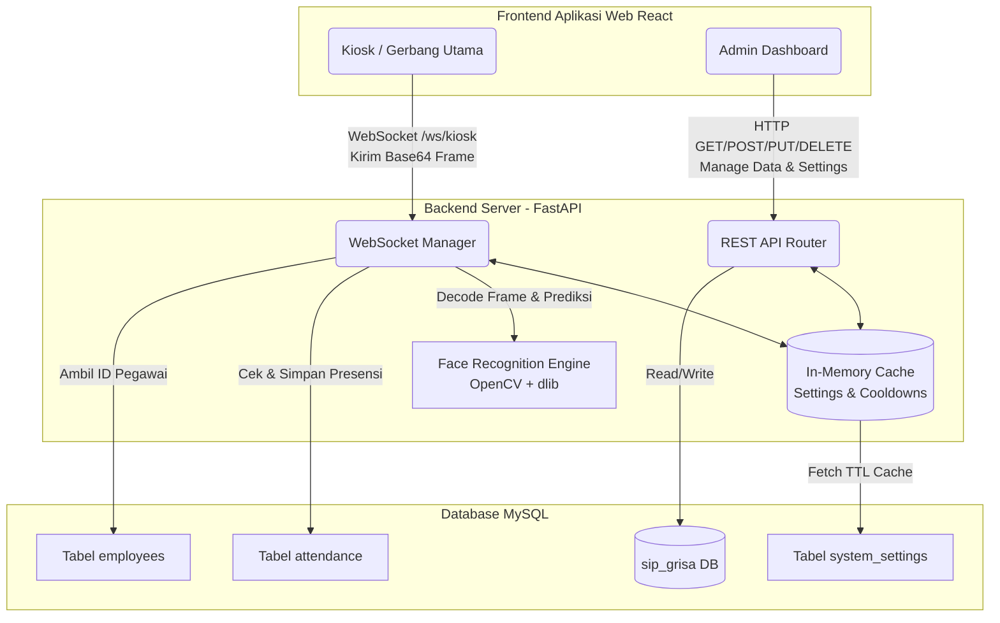
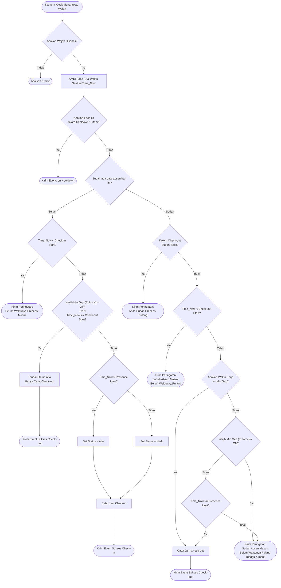

# SIP Grisa - Sistem Presensi Wajah Berbasis AI

SIP Grisa adalah aplikasi presensi karyawan/guru berbasis pengenalan wajah (Face Recognition) yang dibangun dengan FastAPI (Backend) dan React/TypeScript (Frontend). Aplikasi ini dilengkapi dengan **Smart Logic Attendance System** yang mendeteksi, mencegah, dan mengatur alur check-in/check-out secara otomatis dan aman dari kecurangan.

---

## 🛠️ Tech Stack

Sistem ini dibangun dengan teknologi modern untuk menjamin performa tinggi, keamanan, dan pengalaman pengguna yang premium:

### 🍱 Frontend (Client)
- **React 19**: Library UI modern dengan performa tinggi.
- **Vite 6**: Build tool ultra-cepat untuk pengembangan instan.
- **Tailwind CSS 4**: Styling utility-first untuk desain yang bersih dan responsif.
- **Motion (Framer Motion)**: Animasi modal dan feedback visual yang halus.
- **Zustand 5**: State management yang ringan dan efisien.
- **Lucide React**: Koleksi icon yang konsisten dan elegan.

### ⚙️ Backend (Server)
- **FastAPI**: REST API asinkron dengan performa tinggi.
- **Uvicorn**: Server ASGI yang sangat cepat.
- **Python 3.10+**: Bahasa pemrograman utama yang tangguh.
- **Face Recognition (dlib/OpenCV)**: Engine biometrik wajah kelas dunia.
- **PyJWT**: Sistem otentikasi berbasis token yang aman.
- **MySQL**: Penyimpanan data relasional yang persisten dan skalabel.
- **WebSockets**: Komunikasi real-time dua arah untuk Kiosk.

---

## 🏗 Topologi Sistem (System Architecture)



---

## 🧠 Flow Lengkap Presensi Kios (Smart Logic WebSocket)

Berikut adalah alur bagaimana sistem membedakan antara Check-in, Alfa, Early Check-out, dan Check-out yang sukses:



---

## ⚙️ Penjelasan Pengaturan Logika Pintar (Smart Logic Settings)

*   **Jam Mulai Masuk (`checkin_start_time`)**: Sistem menolak absensi jika wajah terscan sebelum jam ini (mencegah absen subuh-subuh).
*   **Jam Mulai Pulang (`checkout_start_time`)**: Sistem menolak absensi pulang jika wajah terscan sebelum jam ini (meskipun sudah lewat Min Gap).
*   **Batas Waktu Presensi (`presence_limit_time`)**: Batas waktu Check-in. Lewat dari jam ini, status presensi otomatis dihitung **Alfa/Terlambat**.
*   **Jeda Pulang Min / Min Gap (`min_gap_minutes`)**: Durasi wajib bagi pegawai untuk berada di sekolah. (Cth: Jika diset 60 menit, pegawai yang telat check-in di jam 13:45 tidak bisa langsung check-out di jam 14:00, mereka harus menunggu hingga 14:45).
*   **Wajib Jeda Pulang (`enforce_min_gap`)**: Jika **dimatikan**, pegawai yang baru datang setelah jam kepulangan (misal datang jam 15:00) akan langsung dicatat sebagai Check-out/Alfa (melompati Check-in). Jika **dinyalakan**, pegawai tersebut tetap wajib menyelesaikan `Min Gap`.
*   **Cooldown Presensi (`cooldown_seconds`)**: Jeda waktu agar sistem tidak nge-spam absen untuk wajah yang sama secara beruntun (Default: 60 detik).

---

---

## ⚙️ Konfigurasi Environment (`.env`)

Sebelum menjalankan aplikasi, Anda perlu menyiapkan file `.env` untuk mengatur koneksi database dan API Key. Salin file contoh yang tersedia:

```bash
cp .env.example .env
```

### Variabel yang Tersedia:

| Variabel | Deskripsi | Default (Docker) |
|---|---|---|
| `GEMINI_API_KEY` | Key untuk fitur AI Recovery (Opsional) | `""` |
| `MYSQL_ROOT_PASSWORD` | Password root untuk database MySQL | `grisa_secure_2026` |
| `SECRET_KEY` | Key rahasia untuk enkripsi JWT | `grisa_super_secret_2026_xyz` |

> [!TIP]
> Jika menggunakan **Docker**, Anda cukup mengatur `GEMINI_API_KEY` dan `MYSQL_ROOT_PASSWORD` di file `.env`. Variabel lain seperti `DB_HOST`, `DB_USER`, dan `DB_NAME` sudah terkonfigurasi otomatis untuk komunikasi antar-container.

---

## 🚀 Cara Menjalankan Aplikasi

### 🐳 Opsi 1: Docker (Production Ready)

Konfigurasi Docker saat ini sudah dioptimalkan untuk performa dan keamanan tinggi (Multi-stage builds, Gzip compression, internal DB network).

**Prasyarat:** Pastikan `docker` dan `docker compose` sudah terinstall.

**Langkah-langkah:**

```bash
# 1. Clone repository
git clone https://github.com/rfypych/SIP-Grisa.git
cd SIP-Grisa

# 2. Siapkan environment
cp .env.example .env
# Edit .env jika ingin mengubah password database atau menambah Gemini Key
# nano .env

# 3. Build dan jalankan
docker compose up -d --build

# 4. Cek status
docker compose ps
```

**Akses Aplikasi:**
- 🌐 **Frontend (Kiosk/Admin)**: `http://localhost` (Port 80)
- ⚙️ **Backend API**: `http://localhost:8000` (Optional access)

> [!IMPORTANT]
> **Keamanan Database**: Port MySQL (3306) sekarang **tertutup dari akses luar** secara default untuk keamanan. Database hanya dapat diakses secara internal oleh container backend. Jika Anda perlu mengakses DB dari luar Docker, buka port 3306 di `docker-compose.yml`.

> ⚠️ **Catatan Build**: Proses build pertama kali memerlukan waktu **10–15 menit** karena kompilasi library biometrik `dlib`. Gunakan stage caching Docker untuk build selanjutnya yang lebih cepat.

**Perintah berguna lainnya:**
```bash
# Menghentikan semua service
docker compose down

# Melihat log semua service
docker compose logs -f

# Restart hanya backend (setelah update kode)
docker compose up -d --build backend

# Menghapus semua termasuk data volume (HATI-HATI: data wajah hilang!)
docker compose down -v
```

---

### 🛠️ Opsi 2: Manual (Untuk Pengembangan Lokal)

**Prasyarat:** Python 3.10+, Node.js 18+, MySQL Server.

**1. Backend (FastAPI)**
```bash
# Install dependencies Python
pip install -r requirements.txt

# Jalankan server
uvicorn api:app --host 0.0.0.0 --port 8000 --reload
```

**2. Frontend (React/Vite)**
```bash
# Install dependencies Node
npm install

# Jalankan dev server (akses di http://localhost:3001)
npm run dev
```

> *Database `sip_grisa` akan dibuat dan diinisialisasi secara otomatis oleh backend saat pertama kali dijalankan.*
