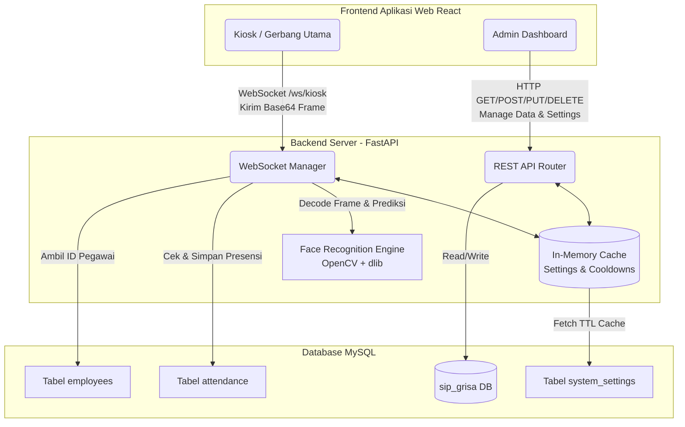

# SIP Grisa - Sistem Presensi Wajah Berbasis AI

SIP Grisa adalah aplikasi presensi karyawan/guru berbasis pengenalan wajah (Face Recognition) yang dibangun dengan FastAPI (Backend) dan React/TypeScript (Frontend). Aplikasi ini dilengkapi dengan **Smart Logic Attendance System** yang mendeteksi, mencegah, dan mengatur alur check-in/check-out secara otomatis dan aman dari kecurangan.

---

## 🏗 Topologi Sistem (System Architecture)



---

## 🧠 Flow Lengkap Presensi Kios (Smart Logic WebSocket)

Berikut adalah alur bagaimana sistem membedakan antara Check-in, Alfa, Early Check-out, dan Check-out yang sukses:

```mermaid
flowchart TD
    Start([Kamera Kiosk Menangkap Wajah]) --> CekWajah{Apakah Wajah Dikenali?}
    CekWajah -- Tidak --> Drop([Abaikan Frame])
    CekWajah -- Ya --> DapatkanData[Ambil Face ID & Waktu Saat Ini Time_Now]

    DapatkanData --> CekCooldown{Apakah Face ID<br>dalam Cooldown 1 Menit?}
    CekCooldown -- Ya --> DropCooldown([Kirim Event: on_cooldown])
    CekCooldown -- Tidak --> CekStatusDB{Sudah ada data absen hari ini?}

    %% --- CABANG BELUM ADA DATA HARI INI (CHECK-IN) ---
    CekStatusDB -- Belum --> CekWaktuMasuk{Time_Now < Check-in Start?}
    CekWaktuMasuk -- Ya --> TolakMasuk([Kirim Peringatan:<br>Belum Waktunya Presensi Masuk])
    CekWaktuMasuk -- Tidak --> CekWajibGap{Wajib Min Gap (Enforce) = OFF<br>DAN<br>Time_Now >= Check-out Start?}

    CekWajibGap -- Ya --> SkipMasuk[Tandai Status Alfa<br>Hanya Catat Check-out] --> BerhasilCheckout([Kirim Event Sukses Check-out])
    CekWajibGap -- Tidak --> CekLimitMasuk{Time_Now > Presence Limit?}

    CekLimitMasuk -- Ya --> SetAlfa[Set Status = Alfa]
    CekLimitMasuk -- Tidak --> SetHadir[Set Status = Hadir]

    SetAlfa --> SimpanCheckin[Catat Jam Check-in]
    SetHadir --> SimpanCheckin
    SimpanCheckin --> BerhasilCheckin([Kirim Event Sukses Check-in])

    %% --- CABANG SUDAH ADA DATA HARI INI (CHECK-OUT) ---
    CekStatusDB -- Sudah --> CekSudahPulang{Kolom Check-out<br>Sudah Terisi?}
    CekSudahPulang -- Ya --> SudahSelesai([Kirim Peringatan:<br>Anda Sudah Presensi Pulang])
    CekSudahPulang -- Tidak --> CekWaktuPulang{Time_Now < Check-out Start?}

    CekWaktuPulang -- Ya --> TolakPulangWaktu([Kirim Peringatan:<br>Sudah Absen Masuk.<br>Belum Waktunya Pulang])
    CekWaktuPulang -- Tidak --> CekMinGap{Apakah Waktu Kerja<br>>= Min Gap?}

    CekMinGap -- Ya --> SimpanCheckout[Catat Jam Check-out] --> BerhasilCheckout2([Kirim Event Sukses Check-out])
    CekMinGap -- Tidak --> CekEnforceGap{Wajib Min Gap (Enforce) = ON?}

    CekEnforceGap -- Ya --> TolakPulangDurasi([Kirim Peringatan:<br>Sudah Absen Masuk.<br>Belum Waktunya Pulang Tunggu X menit])
    CekEnforceGap -- Tidak --> CekLimitPulang{Time_Now >= Presence Limit?}

    CekLimitPulang -- Ya --> SimpanCheckout
    CekLimitPulang -- Tidak --> TolakPulangDurasi
```

---

## ⚙️ Penjelasan Pengaturan Logika Pintar (Smart Logic Settings)

*   **Jam Mulai Masuk (`checkin_start_time`)**: Sistem menolak absensi jika wajah terscan sebelum jam ini (mencegah absen subuh-subuh).
*   **Jam Mulai Pulang (`checkout_start_time`)**: Sistem menolak absensi pulang jika wajah terscan sebelum jam ini (meskipun sudah lewat Min Gap).
*   **Batas Waktu Presensi (`presence_limit_time`)**: Batas waktu Check-in. Lewat dari jam ini, status presensi otomatis dihitung **Alfa/Terlambat**.
*   **Jeda Pulang Min / Min Gap (`min_gap_minutes`)**: Durasi wajib bagi pegawai untuk berada di sekolah. (Cth: Jika diset 60 menit, pegawai yang telat check-in di jam 13:45 tidak bisa langsung check-out di jam 14:00, mereka harus menunggu hingga 14:45).
*   **Wajib Jeda Pulang (`enforce_min_gap`)**: Jika **dimatikan**, pegawai yang baru datang setelah jam kepulangan (misal datang jam 15:00) akan langsung dicatat sebagai Check-out/Alfa (melompati Check-in). Jika **dinyalakan**, pegawai tersebut tetap wajib menyelesaikan `Min Gap`.
*   **Cooldown Presensi (`cooldown_seconds`)**: Jeda waktu agar sistem tidak nge-spam absen untuk wajah yang sama secara beruntun (Default: 60 detik).

---

## 🚀 Cara Menjalankan Aplikasi

1.  **Backend (FastAPI)**
    ```bash
    pip install -r requirements.txt
    python api.py
    ```
    Atau via Uvicorn langsung:
    ```bash
    uvicorn api:app --host 0.0.0.0 --port 8000
    ```

2.  **Frontend (React/Vite)**
    ```bash
    npm install
    npm run dev &
    ```

*Note: Database akan terinisialisasi dan dibuat otomatis ke dalam MySQL saat pertama kali backend (`api.py`) dihidupkan.*
